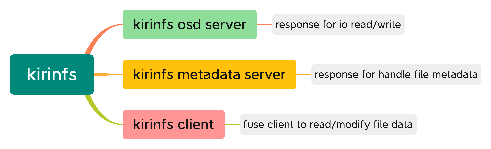

# kirinfs

## 功能介绍

- 实现基于fuse的客户端
- 实现数据读取的osd
- 实现基于Wt引擎的metadata server

## MGS功能

1. **集群配置**
   1. **生成默认配置**
   2. **分布式锁召回最短时召回时间，最长为2倍**
   3. **grant大小（客户端提前给予的大小）**
   4. **obd ping间隔**
   5. **鉴权开关（非root访问）**
   6. **挂载数量的上限**
2. **配置存储**
   1. **将相关的策略存储到文件中**
3. **配置下发**
   1. **当OST/MDT/client挂载拉取配置时，将配置进行下发**
   2. **当刚配置结束后将配置下发给集群中所以非mgs节点**
4. **挂载**
   1. **服务端**
      1. **挂载时下发配置**
      2. **挂载时获取OST/MDT的配置，检查配置是否正确（比如OST/MDT的index是否有重复），同时生成校验文件，防止OST/MDT发生替换后不正确。**
         1. **检查配置参数**
         2. **保存配置参数到topo和文件中**
         3. **生成校验文件**
      3. **挂载上限设置**
   2. **客户端**
      1. **检查挂载指令**
      2. **返回服务端的topo**
      3. **下发集群配置给客户端**
