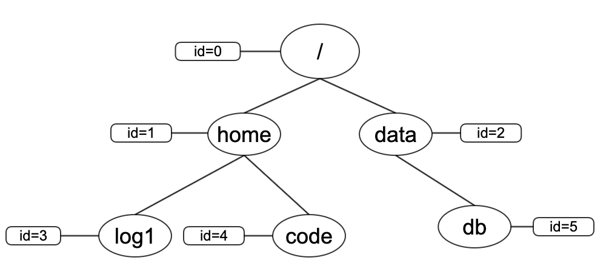

# metadata-server

## metadata存储格式

- 元数据存储的格式如下:

|  key   | value  |
|  ----  | ----  |
| <0,hash(home)>  | {1,"home",extend-attribute} |
| <0,hash(data)>  | {2,"data",extend-attribute} |
| <1,hash(log1)>  | {3,"log1",extend-attribute} |
| <1,hash(code)>  | {4,"code",extend-attribute} |
| <2,hash(db)>    | {5,"db",extend-attribute}   |
